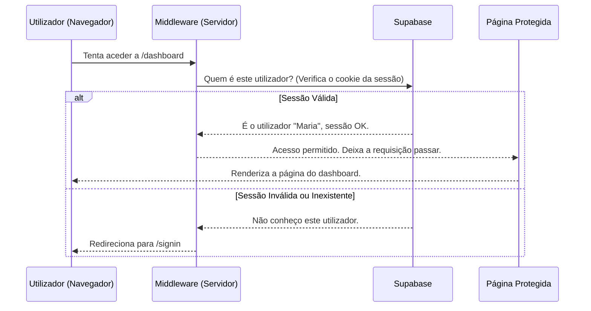

# Chapter 1: Autenticação e Autorização


Bem-vindo ao tutorial da Plataforma de Agentes VIA! Neste primeiro capítulo, vamos explorar a base de toda a segurança da nossa aplicação: o sistema de **Autenticação e Autorização**.

Imagine que a nossa plataforma é um clube exclusivo. Antes de poder entrar e usar as instalações, você precisa provar quem é e, uma vez lá dentro, seu acesso pode ser limitado a certas áreas. É exatamente isso que este sistema faz. Ele atua como o porteiro e o gerente de segurança, garantindo que apenas as pessoas certas acessem os lugares certos.

Neste capítulo, vamos desvendar:
*   O que são autenticação e autorização.
*   Como um usuário faz login na plataforma.
*   Como protegemos nossas páginas e dados, garantindo que ninguém acesse o que não deve.

Vamos começar!

## O Porteiro e a Lista VIP: Entendendo o Conceito

No nosso dia a dia, lidamos com esses conceitos o tempo todo.

1.  **Autenticação**: É o ato de provar que você é quem diz ser. Quando você insere seu email e senha em um site, está se autenticando. É como mostrar sua identidade ao porteiro do clube. Ele verifica sua foto e seu nome e confirma: "Ok, você é o João da Silva".

2.  **Autorização**: Uma vez que o porteiro sabe quem você é, ele precisa decidir o que você pode fazer. Ele olha para uma lista e diz: "João, você tem acesso geral, mas a área VIP é restrita". A autorização é o processo de conceder ou negar permissões com base na sua identidade.

Na nossa plataforma, usamos um serviço poderoso chamado **Supabase** para gerenciar a identidade dos usuários (o cadastro e o login). Além disso, temos um "vigia" em nosso código, chamado **Middleware**, que intercepta cada tentativa de acesso para verificar as credenciais do usuário antes de deixá-lo prosseguir.

## Como um Usuário Entra na Plataforma

A primeira interação de um usuário com nosso sistema de segurança é a tela de login. Vamos ver como ela funciona.

A interface de login é construída com React e componentes da nossa biblioteca `shadcn/ui`.

```tsx
// Ficheiro: src/features/signin/index.tsx

// ... (importações e configuração inicial do estado)

export default function SigninInterface() {
  const { signIn } = useAuthContext(); // Obtém a função de login do nosso "provedor de autenticação"
  const router = useRouter(); // Para redirecionar o usuário após o login

  const [email, setEmail] = useState("");
  const [password, setPassword] = useState("");
  const [error, setError] = useState<string | null>(null);
  // ... (outros estados para feedback ao usuário)

  const handleSubmit = async (e: React.FormEvent) => {
    e.preventDefault();
    setError(null);
    setIsLoading(true);

    try {
      // Chama a função de login com email e senha
      const result = await signIn({ email, password });

      if (result.error) {
        setError(result.error.message); // Mostra um erro se o login falhar
      } else {
        setIsSuccess(true); // Mostra uma mensagem de sucesso
        // O redirecionamento é tratado automaticamente
      }
    } catch (err) {
      setError("Erro inesperado. Tente novamente.");
    } finally {
      setIsLoading(false);
    }
  };

  // ... (JSX para renderizar o formulário)
}
```

Este código é bastante direto:
1.  **`useAuthContext()`**: Este é um *Hook* do React que nos dá acesso a funções essenciais de autenticação, como `signIn`. Pense nele como uma caixa de ferramentas de segurança que podemos usar em qualquer componente.
2.  **`useState`**: Usamos o estado do React para guardar o que o usuário digita nos campos de email e senha, além de quaisquer mensagens de erro ou sucesso.
3.  **`handleSubmit`**: Quando o usuário clica em "Entrar", esta função é chamada. Ela pega o email e a senha e os envia para a nossa função `signIn`. Se o login for bem-sucedido, o estado da aplicação é atualizado e o usuário será redirecionado. Se falhar, uma mensagem de erro é exibida.

O formulário em si é composto por componentes reutilizáveis, como `Card`, `Input` e `Button`, que mantêm a nossa interface consistente.

```tsx
// Ficheiro: src/features/signin/index.tsx (parte do JSX)

<Card className="w-full max-w-md">
  <CardHeader>
    <CardTitle className="text-center text-2xl">Entrar</CardTitle>
  </CardHeader>
  <CardContent>
    <form onSubmit={handleSubmit} className="space-y-4">
      <div className="space-y-2">
        <Label htmlFor="email">Email</Label>
        <Input
          id="email"
          type="email"
          placeholder="nome@exemplo.com.br"
          value={email}
          onChange={(e) => setEmail(e.target.value)}
        />
      </div>
      {/* ... Campo de senha ... */}
      {error && (
        <Alert variant="destructive">
          <AlertDescription>{error}</AlertDescription>
        </Alert>
      )}
      <Button type="submit" className="w-full" disabled={isLoading}>
        {isLoading ? "Entrando..." : "Entrar"}
      </Button>
    </form>
  </CardContent>
  {/* ... (links para cadastro e "esqueci minha senha") */}
</Card>
```
Este trecho de JSX simplesmente renderiza o formulário que o usuário vê. Note como o estado `error` é usado para mostrar condicionalmente um `Alert` de erro, dando um feedback claro ao usuário.

## Por Trás das Cortinas: O Fluxo de Segurança

Ok, o usuário clicou em "Entrar". O que acontece a seguir? E como garantimos que um usuário não autenticado não possa simplesmente digitar `www.nossa-plataforma.com/dashboard` no navegador e aceder a tudo?

Aqui é onde a mágica acontece. O processo envolve o nosso *Middleware* e o *Provedor de Autenticação*.

Vamos visualizar o fluxo quando um usuário tenta aceder a uma página protegida:



Este diagrama mostra o papel crucial do **Middleware**. Ele age como um guarda em cada porta. Antes que qualquer código da página de destino seja executado, o middleware intervém.

### O Middleware: Nosso Guarda de Fronteira

O middleware é uma função que é executada no servidor para cada requisição que chega à nossa aplicação. O nosso está definido em `src/lib/auth/middleware.ts`.

Sua lógica principal é:

1.  Verificar se o utilizador está a tentar aceder a uma página pública (como `/signin` ou `/signup`). Se sim, não faz nada.
2.  Se a página for protegida, ele usa as funções do Supabase para verificar se existe uma sessão de usuário válida.
3.  Se não houver sessão, ele redireciona o usuário para a página de login.
4.  Se houver sessão, ele permite que a requisição continue e a página solicitada seja carregada.

Vamos ver um trecho simplificado do código:

```typescript
// Ficheiro: src/lib/auth/middleware.ts

import { createServerClient } from "@supabase/ssr";
import { NextResponse, type NextRequest } from "next/server";

const NO_AUTH_PATHS = ["/signin", "/signup", "/forgot-password"];

export async function updateSession(request: NextRequest) {
  // ... (código de configuração do Supabase no servidor)
  const supabase = createServerClient(/* ... */);

  // Pede ao Supabase para obter os dados do usuário a partir dos cookies da requisição
  const { data: { user } } = await supabase.auth.getUser();

  // Se NÃO houver usuário E o caminho NÃO for uma página pública...
  if (
    !user &&
    !NO_AUTH_PATHS.some((path) => request.nextUrl.pathname.startsWith(path))
  ) {
    // ...redireciona para a página de login.
    const url = request.nextUrl.clone();
    url.pathname = "/signin";
    return NextResponse.redirect(url);
  }

  // Se o usuário estiver autenticado, continua para a página solicitada.
  return NextResponse.next({ request });
}
```

Esta é a essência da proteção de rotas na nossa plataforma. Simples, mas extremamente eficaz.

### O Provedor de Autenticação: A Caixa de Ferramentas Central

Mencionámos o `useAuthContext` anteriormente. Ele vem de um *React Context Provider* definido em `src/providers/Auth.tsx`. Este provedor é um componente especial que envolve toda a nossa aplicação e tem duas responsabilidades principais:

1.  **Manter o Estado da Autenticação**: Ele sabe se há um usuário logado, quem ele é, e disponibiliza essa informação (`user`, `session`, `isAuthenticated`) para qualquer componente que precise.
2.  **Expor Ações de Autenticação**: Ele fornece funções fáceis de usar (`signIn`, `signOut`, `signUp`) para que os componentes não precisem saber os detalhes de como falar com o Supabase.

```typescript
// Ficheiro: src/providers/Auth.tsx

// ... (importações)

interface AuthContextProps {
  session: Session | null;
  user: User | null;
  isAuthenticated: boolean;
  signIn: (credentials: AuthCredentials) => Promise<{ /* ... */ }>;
  signOut: () => Promise<{ /* ... */ }>;
  // ... (outras funções)
}

// Cria o provedor de autenticação que irá "abraçar" nossa aplicação
export function AuthProvider({ children }: { children: React.ReactNode }) {
  const [session, setSession] = useState<Session | null>(null);
  const [user, setUser] = useState<User | null>(null);

  // ... (lógica para carregar a sessão inicial e ouvir mudanças de estado)

  const value = {
    session,
    user,
    isAuthenticated: !!session?.user, // Verdadeiro se houver um usuário na sessão
    signIn: provider.signIn.bind(provider), // Fornece a função de login
    signOut: provider.signOut.bind(provider), // Fornece a função de logout
    // ...
  };

  return <AuthContext.Provider value={value}>{children}</AuthContext.Provider>;
}
```

Ao "embrulhar" a nossa aplicação com este `AuthProvider`, garantimos que qualquer componente, como a nossa página de login ou o cabeçalho que mostra o nome do usuário, pode facilmente aceder a estas informações e funções usando o *hook* `useAuthContext()`.

Esta estrutura separa as preocupações:
*   **Componentes da UI** (como `SigninInterface`): Apenas se preocupam em mostrar formulários e chamar funções como `signIn`.
*   **AuthProvider**: Gerencia o estado central de autenticação.
*   **SupabaseAuthProvider** (`src/lib/auth/supabase.ts`): Contém a lógica específica para comunicar com o Supabase.
*   **Middleware**: Protege as rotas no lado do servidor.

## Conclusão

Neste capítulo, desvendamos o sistema de segurança da Plataforma de Agentes VIA. Aprendemos a diferença fundamental entre **autenticação** (provar quem você é) e **autorização** (o que você tem permissão para fazer).

Vimos como a combinação de uma interface de login amigável, um provedor de autenticação centralizado e um middleware vigilante no servidor trabalham juntos para criar uma experiência segura e fluida. Com o Supabase a tratar da complexidade da gestão de utilizadores, podemos focar-nos em construir as funcionalidades incríveis da plataforma, sabendo que o acesso está bem protegido.

Agora que entendemos como os utilizadores entram e são validados na plataforma, estamos prontos para explorar o coração da aplicação. No próximo capítulo, vamos mergulhar na criação e gestão dos seus próprios assistentes de IA.

A seguir: [Capítulo 2: Gerenciamento de Agentes e Configuração](02_gerenciamento_de_agentes_e_configuração_.md)

---

Generated by [AI Codebase Knowledge Builder](https://github.com/The-Pocket/Tutorial-Codebase-Knowledge)