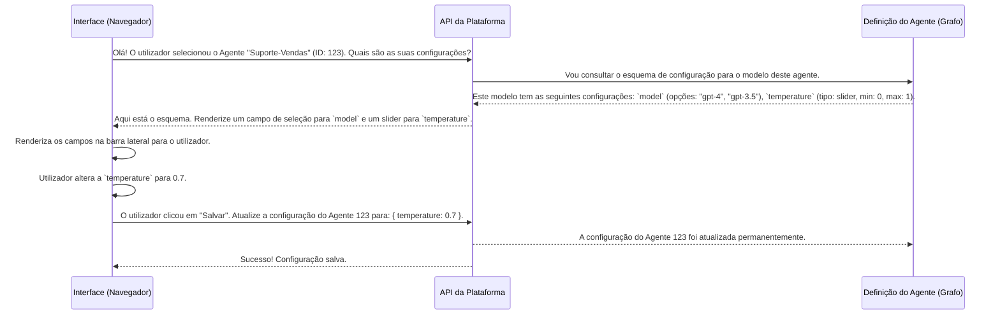

# Chapter 2: Gerenciamento de Agentes e Configuração


No [Capítulo 1: Autenticação e Autorização](01_autenticação_e_autorização_.md), garantimos que apenas os utilizadores certos podem entrar na nossa plataforma. Agora que você tem as chaves, está na hora de entrar na oficina e começar a construir e personalizar os seus próprios assistentes de IA.

Pense neste capítulo como o seu painel de controlo. É aqui que a magia realmente começa. Você aprenderá a criar novos agentes, ver todos os que já existem e, o mais importante, ajustar a "personalidade" e as habilidades de cada um.

Imagine que você quer criar um agente de suporte ao cliente. Você precisa que ele seja amigável, fale português e saiba responder a perguntas sobre devoluções. Como você ensina isso a ele? É exatamente o que vamos descobrir. Este sistema permite que você ajuste o comportamento de um agente através de uma interface simples, sem precisar tocar numa única linha de código do núcleo do agente.

## O Agente, o Modelo e os Ajustes Finos

Para entender como gerimos os agentes, vamos quebrar o conceito em três partes fundamentais:

1.  **Modelo (ou Grafo)**: Esta é a "planta" ou a "receita" de um agente. Um modelo define a estrutura lógica e as capacidades base de um tipo de agente. Por exemplo, podemos ter um modelo chamado `Agente de Atendimento ao Cliente` que já sabe como conversar e usar ferramentas básicas.

2.  **Agente**: Este é a sua instância específica e funcional, criada a partir de um modelo. Usando o modelo `Agente de Atendimento ao Cliente`, você pode criar vários agentes: um para "Suporte de Vendas", outro para "Suporte Técnico", etc. Cada um é um agente individual, com a sua própria memória e configuração.

3.  **Configuração**: Estes são os "botões de ajuste" do seu agente. Depois de criar um agente a partir de um modelo, você pode querer personalizar o seu comportamento. A configuração permite-lhe fazer isso. Para o nosso agente de suporte, as configurações poderiam ser "Tom da Conversa" (Formal ou Amigável) ou "Modelo de Linguagem a ser Usado" (GPT-4 ou GPT-3.5).

A nossa plataforma permite-lhe gerir tudo isto de forma visual e intuitiva.

## Criando e Configurando o seu Primeiro Agente

Vamos colocar a mão na massa. O nosso objetivo é criar um novo agente a partir de um modelo existente e depois ajustar as suas configurações.

### Passo 1: O Painel de Controlo dos Agentes

Tudo começa na página de "Agentes". Aqui, você tem uma visão geral de tudo o que está relacionado com os seus assistentes.

A interface, definida em `src/features/agents/index.tsx`, tem duas abas principais:
*   **Modelos**: A sua "fábrica" de agentes. Aqui estão todas as plantas (grafos) disponíveis para criar novos agentes.
*   **Todos os Agentes**: A sua "garagem". Aqui estão todos os agentes que você já criou, prontos para serem usados ou modificados.

```tsx
// Ficheiro: src/features/agents/index.tsx (simplificado)

export default function AgentsInterfaceV2() {
  return (
    <div className="container mx-auto px-4 py-6">
      <PageHeader
        title="Agentes"
        description="Gerencie seus agentes em diferentes modelos"
      />

      <Tabs defaultValue="templates" className="mt-6">
        <TabsList>
          {/* Aba para ver as "plantas" dos agentes */}
          <TabsTrigger value="templates">Modelos</TabsTrigger>
          {/* Aba para ver os agentes já criados */}
          <TabsTrigger value="all-agents">Todos os Agentes</TabsTrigger>
        </TabsList>

        <TabsContent value="templates">
          {/* Aqui é renderizada a lista de modelos (TemplatesList) */}
        </TabsContent>

        <TabsContent value="all-agents">
          {/* Aqui é renderizada a lista dos seus agentes (AgentDashboard) */}
        </TabsContent>
      </Tabs>
    </div>
  );
}
```
Para criar um novo agente, você iria para a aba "Modelos", escolheria um modelo como "Agente Assistente Básico" e clicaria em "Criar Agente". A plataforma criaria uma nova cópia funcional desse agente para você.

### Passo 2: O Painel de Configuração

Depois de criar ou selecionar um agente e iniciar um chat com ele, a barra lateral de configuração torna-se disponível. É aqui que você pode ajustar o comportamento do agente selecionado.

Esta barra lateral é um componente React chamado `ConfigurationSidebar`, e a sua principal tarefa é mostrar dinamicamente as opções de configuração disponíveis para o agente atual.

```tsx
// Ficheiro: src/features/chat/components/configuration-sidebar/index.tsx (simplificado)

export const ConfigurationSidebar = forwardRef(({ open }, ref) => {
  const { configurations, loading } = useAgentConfig(); // Hook para obter as configs
  const [agentId] = useQueryState("agentId"); // Obtém o ID do agente atual da URL

  // ... (lógica para salvar, redefinir, etc.)

  return (
    <div className={/* ...estilos... */}>
      {open && (
        <div className="flex h-full flex-col">
          <div className="flex items-center justify-between p-4">
            <h2 className="font-semibold">Configuração do Agente</h2>
            <div className="flex gap-2">
              <Button onClick={handleSave}> {/* Botão para salvar */}
                <Save className="mr-1 h-4 w-4" />
                Salvar
              </Button>
            </div>
          </div>

          <Tabs defaultValue="general">
            <TabsList>
              <TabsTrigger value="general">Geral</TabsTrigger>
              {/* Outras abas como Ferramentas, RAG, etc., aparecem aqui se o agente as suportar */}
            </TabsList>

            <TabsContent value="general" className="p-4">
              <ConfigSection title="Configuração">
                {/* O React mapeia as configurações e renderiza um campo para cada uma */}
                {configurations.map((c) => (
                  <ConfigField
                    key={c.label}
                    label={c.label}
                    description={c.description}
                    // ...outras propriedades para renderizar o campo (slider, switch, etc.)
                  />
                ))}
              </ConfigSection>
            </TabsContent>
          </Tabs>
        </div>
      )}
    </div>
  );
});
```
O ponto-chave aqui é que a barra lateral não tem configurações "hard-coded". Ela pergunta ao agente: "Quais são as suas configurações ajustáveis?" e, em seguida, constrói a interface com base na resposta. Isso torna a plataforma incrivelmente flexível.

## Por Trás das Cortinas: Como a Configuração Funciona

Como é que a interface sabe quais campos mostrar para cada agente? Este processo envolve uma comunicação inteligente entre a interface do utilizador (frontend) e a nossa API de agentes (backend).

Vamos visualizar o fluxo quando você seleciona um agente para configurar:



Este diagrama mostra que a "verdade" sobre o que é configurável vem do próprio **Grafo** do agente, garantindo que a UI esteja sempre sincronizada com as capacidades reais do agente.

### O Cérebro da Operação: Hooks e Stores

Vários ficheiros trabalham em conjunto para que esta magia aconteça. Vamos destacar os mais importantes.

#### 1. Carregando os Agentes: `AgentsProvider`

Tudo começa com o `AgentsProvider` (`src/providers/Agents.tsx`). Este componente é um "provedor de contexto" do React que envolve a nossa aplicação. A sua principal função é carregar a lista de todos os agentes e modelos disponíveis assim que o utilizador faz login. Ele age como o nosso gestor central de inventário de agentes.

```typescript
// Ficheiro: src/providers/Agents.tsx (lógica central)

async function getAgents(
  deployments: Deployment[],
  accessToken: string,
  // ... outras dependências
): Promise<Agent[]> {
  // Para cada "deployment" (ambiente), busca todos os agentes
  const agentsPromise: Promise<Agent[]>[] = deployments.map(
    async (deployment) => {
      const client = createClient(deployment.id, accessToken); // Cria um cliente API
      const allUserAssistants = await client.assistants.search({ limit: 100 }); // Busca os agentes do utilizador
      // ... Lógica para também obter os modelos padrão e agrupar
      return allAssistants;
    },
  );

  return (await Promise.all(agentsPromise)).flat(); // Retorna uma lista única de todos os agentes
}
```
Este provedor garante que a lista de agentes esteja sempre disponível para outras partes da aplicação, como o painel de agentes e a lista de seleção no chat.

#### 2. Obtendo o Esquema de Configuração: `useAgentConfig`

Quando você seleciona um agente, o *hook* `useAgentConfig` (`src/hooks/use-agent-config.tsx`) entra em ação. A sua função `getSchemaAndUpdateConfig` é a responsável por comunicar com a API para pedir o "manual de instruções" (o esquema) daquele agente específico.

```typescript
// Ficheiro: src/hooks/use-agent-config.tsx (simplificado)

export function useAgentConfig() {
  const { getAgentConfigSchema } = useAgents(); // Hook que sabe como chamar a API
  const [loading, setLoading] = useState(false);

  const getSchemaAndUpdateConfig = useCallback(async (agent: Agent) => {
    setLoading(true);
    try {
      // 1. Pede o esquema de configuração para o agente específico
      const schema = await getAgentConfigSchema(
        agent.assistant_id,
        agent.deploymentId,
      );
      if (!schema) return; // Se não houver esquema, não há nada a fazer

      // 2. Extrai e formata as configurações para a UI
      const { configFields, toolConfig, ragConfig } =
        extractConfigurationsFromAgent({ agent, schema });

      // 3. Atualiza o estado para que a UI possa renderizar os campos
      setConfigurations(configFields);
      // ... define outras configurações como ferramentas e RAG

    } finally {
      setLoading(false);
    }
  }, [/* ... */]);

  // ... retorna as configurações e o estado de carregamento
}
```

#### 3. Traduzindo o Esquema: `ui-config.ts`

A API retorna um esquema num formato técnico (JSON Schema). A função `extractConfigurationsFromAgent` em `src/lib/ui-config.ts` atua como um tradutor, convertendo esse esquema em algo que os componentes React possam entender e renderizar facilmente. Ela procura por uma anotação especial, `x_oap_ui_config`, para saber como apresentar cada campo (por exemplo, como um slider, um switch ou uma caixa de texto).

#### 4. Gerindo as Alterações: `useConfigStore`

O que acontece quando você muda um valor num slider, mas ainda não clicou em "Salvar"? Essas alterações temporárias precisam de ser guardadas em algum lugar. É para isso que serve o `useConfigStore` (`src/features/chat/hooks/use-config-store.tsx`).

Ele usa uma biblioteca chamada **Zustand** para criar um "armazém" de estado global. Cada alteração que você faz na UI chama a função `updateConfig`, que armazena o novo valor nesse armazém, associado ao ID do agente.

```typescript
// Ficheiro: src/features/chat/hooks/use-config-store.tsx (simplificado)

// Interface que define as ações do nosso armazém de configurações
interface ConfigState {
  configsByAgentId: Record<string, Record<string, any>>; // Guarda configs por ID do agente
  updateConfig: (agentId: string, key: string, value: any) => void; // Atualiza um valor
  resetConfig: (agentId: string) => void; // Volta para o último estado salvo
  // ...
}

export const useConfigStore = create<ConfigState>()(
  persist( // O "persist" faz com que as alterações não salvas sobrevivam a um refresh da página
    (set, get) => ({
      configsByAgentId: {},

      updateConfig: (agentId, key, value) =>
        set((state) => ({
          configsByAgentId: {
            ...state.configsByAgentId,
            [agentId]: {
              ...(state.configsByAgentId[agentId] || {}),
              [key]: value, // Atualiza a chave específica para o agente
            },
          },
        })),
      
      // ... outras funções como resetConfig
    }),
    { name: "ai-config-storage" },
  ),
);
```

#### 5. Salvando Permanentemente: `useAgents`

Finalmente, quando você clica em "Salvar", a função `handleSave` na `ConfigurationSidebar` chama a função `updateAgent` do *hook* `useAgents` (`src/hooks/use-agents.tsx`). Esta função pega todas as configurações temporárias do `useConfigStore` e as envia para a API, que as salva permanentemente na base de dados do agente.

```typescript
// Ficheiro: src/hooks/use-agents.tsx (função de atualização)

export function useAgents() {
  const { session } = useAuthContext();

  const updateAgent = useCallback(
    async (
      agentId: string,
      deploymentId: string,
      args: { config?: Record<string, any> }, // Argumentos, incluindo a nova configuração
    ): Promise<Assistant | undefined> => {
      // ... (verificação de token de acesso)
      try {
        const client = createClient(deploymentId, session.accessToken);
        // Chama a API para atualizar o assistente com a nova configuração
        const agent = await client.assistants.update(agentId, {
          ...(args.config && { config: { configurable: args.config } }),
        });
        return agent;
      } catch (e) {
        console.error("Falha ao atualizar o agente", e);
        toast.error("Falha ao atualizar o agente");
      }
    },
    [session?.accessToken],
  );

  return { /* ..., */ updateAgent, /* ... */ };
}
```

## Conclusão

Neste capítulo, abrimos o capô da nossa "fábrica" de agentes. Vimos que a nossa plataforma trata **Modelos (Grafos)** como plantas e **Agentes** como as criações individuais feitas a partir delas.

O mais poderoso é o sistema de **Configuração**. Ele permite que cada agente tenha a sua própria personalidade e conjunto de habilidades, que podem ser ajustadas através de uma interface gráfica dinâmica. Aprendemos que esta interface não é estática; ela é construída em tempo real com base num "esquema" fornecido pelo próprio agente, garantindo flexibilidade máxima.

Agora que você sabe como criar e configurar um agente, falta um ingrediente crucial: o conhecimento. Um agente, por mais bem configurado que seja, não é muito útil se não tiver acesso a informações relevantes. Como podemos dar-lhe os seus documentos, manuais ou bases de dados para que ele possa responder a perguntas específicas?

É exatamente isso que vamos explorar no próximo capítulo, mergulhando no fascinante mundo do RAG (Retrieval-Augmented Generation).

A seguir: [Capítulo 3: RAG e Gerenciamento de Documentos](03_rag_e_gerenciamento_de_documentos_.md)

---

Generated by [AI Codebase Knowledge Builder](https://github.com/The-Pocket/Tutorial-Codebase-Knowledge)