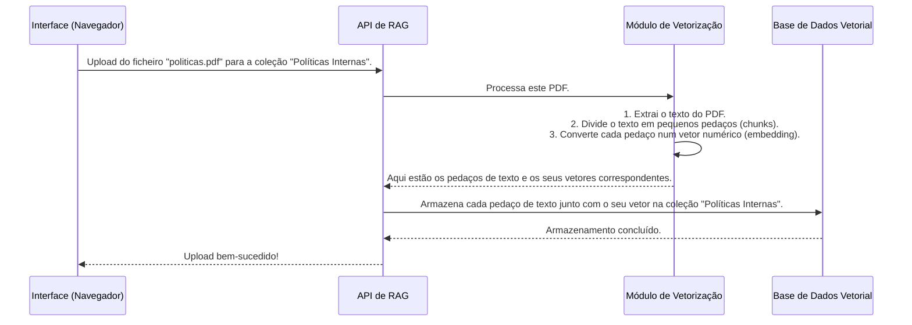
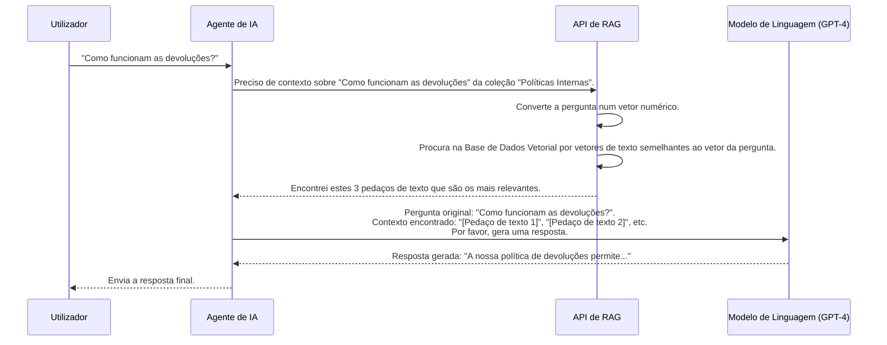

# Chapter 3: RAG e Gerenciamento de Documentos


Nos capítulos anteriores, aprendemos como entrar na plataforma e [como criar e configurar os nossos próprios agentes](02_gerenciamento_de_agentes_e_configuração_.md). Agora, os nossos agentes estão prontos e à espera de instruções. Mas e se quisermos que um agente responda a perguntas sobre um tópico muito específico, como a política de devoluções da nossa empresa, que está detalhada num documento PDF?

É aqui que entra uma das funcionalidades mais poderosas da Plataforma VIA: o **RAG (Retrieval-Augmented Generation)**.

Esta funcionalidade permite "alimentar" os seus agentes com conhecimento específico. É como dar-lhes uma biblioteca particular para consultar. Você pode fazer upload de documentos (como PDFs ou ficheiros de texto) e organizá-los em "coleções". Quando um agente precisa de responder a uma pergunta, ele primeiro procura informações relevantes nessas coleções (**Recuperação**) antes de gerar uma resposta (**Geração**).

Isso torna os agentes muito mais poderosos e precisos em domínios específicos, pois eles não dependem apenas do seu conhecimento pré-treinado. Vamos aprender como transformar os nossos agentes em verdadeiros especialistas!

## A Biblioteca Pessoal do seu Agente

Imagine que você tem um assistente pessoal. Ele é inteligente, mas não sabe os detalhes do seu novo projeto. O que você faria? Provavelmente, entregaria a ele uma pasta com todos os documentos relevantes e diria: "Estude isto". O sistema RAG funciona de forma muito semelhante.

Vamos dividir este conceito em duas partes simples:

1.  **Coleções**: Pense numa coleção como uma estante na sua biblioteca. Você pode ter uma estante para "Políticas da Empresa", outra para "Manuais de Produtos" e uma terceira para "Relatórios Financeiros". Na nossa plataforma, uma coleção é um contentor digital que agrupa documentos relacionados.

2.  **Documentos**: Estes são os livros na sua estante. Podem ser ficheiros PDF, documentos de texto simples (`.txt`) ou até mesmo texto que você cola diretamente na plataforma. Cada documento contém o conhecimento bruto que você quer que o seu agente aprenda.

Quando você faz uma pergunta a um agente que usa RAG, ele não adivinha a resposta. Ele vai primeiro à estante (coleção) correta, folheia os livros (documentos) relevantes, encontra os parágrafos mais importantes e só então usa essa informação para construir uma resposta completa e precisa para você.

## Dando Conhecimento ao seu Agente

A gestão de todo este conhecimento é feita através de uma interface dedicada na plataforma. Vamos ver como usá-la.

A página de RAG, definida em `src/features/rag/index.tsx`, apresenta uma visão clara e organizada. À esquerda, temos as nossas "estantes" (Coleções), e à direita, os "livros" (Documentos) que estão dentro da coleção selecionada.

```tsx
// Ficheiro: src/features/rag/index.tsx (simplificado)

export default function RAGInterface() {
  const { selectedCollection, collections, initialSearchExecuted } = useRagContext();

  // ... (estado para paginação)

  if (initialSearchExecuted && !collections.length) {
    return <EmptyCollectionsState />; // Mostra uma mensagem se não houver coleções
  }

  return (
    <div className="grid grid-cols-1 gap-6 md:grid-cols-3">
      {/* Secção de Coleções (à esquerda) */}
      <div className="md:col-span-1">
        <CollectionsCard /* ...props para gerir coleções... */ />
      </div>

      {/* Secção de Documentos (à direita) */}
      <div className="md:col-span-2">
        <DocumentsCard /* ...props para gerir documentos... */ />
      </div>
    </div>
  );
}
```
Esta estrutura divide a interface em duas partes lógicas, tornando o processo de gestão de conhecimento muito intuitivo.

### Passo 1: Criar a sua Primeira Coleção

Antes de podermos adicionar documentos, precisamos de uma "estante" para os colocar. Vamos criar uma coleção chamada "Políticas Internas".

No painel de Coleções, você encontrará um botão para criar uma nova. Clicar nele abre um diálogo simples.

```tsx
// Ficheiro: src/features/rag/components/collections-card.tsx (parte da lógica)

// A função chamada quando o formulário de criação é submetido
const handleCreateCollection = async (name: string, description: string) => {
  const loadingToast = toast.loading("Criando coleção...");
  
  // Chama a função do nosso hook para comunicar com a API
  const success = await createCollection(name, { description });
  
  toast.dismiss(loadingToast);
  if (success) {
    setOpen(false); // Fecha o diálogo
    toast.success("Coleção criada com sucesso");
  } else {
    toast.warning("Não foi possível criar a coleção.");
  }
};

// ... no JSX ...
<Card>
  <CardHeader>
    <CardTitle>Coleções</CardTitle>
    {/* Este componente renderiza o botão e o diálogo de criação */}
    <CreateCollectionDialog onSubmit={handleCreateCollection} />
  </CardHeader>
  <CardContent>
    {/* Aqui é renderizada a lista das suas coleções */}
    <CollectionsList /* ... */ />
  </CardContent>
</Card>
```
Este código mostra que, quando você preenche o nome e a descrição e clica em "Criar", a função `handleCreateCollection` é chamada. Ela usa a função `createCollection` (que vive no nosso *hook* de gestão de RAG) para enviar o pedido à nossa API. Simples assim!

### Passo 2: Adicionar Documentos à Coleção

Com a nossa coleção "Políticas Internas" criada e selecionada, o painel da direita está pronto para receber documentos.

A plataforma oferece duas maneiras de adicionar conhecimento:

1.  **Upload de Ficheiro**: Você pode arrastar e soltar ficheiros (PDF, TXT, HTML) diretamente na área designada ou clicar para os procurar no seu computador.
2.  **Adicionar Texto**: Você pode colar um bloco de texto diretamente numa caixa de texto. Isto é útil para adicionar pequenas notas ou informações rápidas.

```tsx
// Ficheiro: src/features/rag/components/documents-card/index.tsx (simplificado)

export function DocumentsCard({ selectedCollection }) {
  // ... (estados para ficheiros, texto, etc.)

  const handleUploadStagedFiles = async () => {
    // ... (validações)
    setIsUploading(true);
    // Chama a função do hook para fazer o upload dos ficheiros
    await handleDocumentFileUpload(stagedFiles, selectedCollection.uuid);
    setIsUploading(false);
    setStagedFiles([]); // Limpa a lista de ficheiros após o upload
  };

  const handleTextUpload = async () => {
    // ... (validações)
    setIsUploading(true);
    // Chama a função do hook para fazer o upload do texto
    await handleDocumentTextUpload(textInput, selectedCollection.uuid);
    setIsUploading(false);
    setTextInput("");
  };

  // ... (JSX para renderizar as abas de "Upload de Ficheiro" e "Adicionar Texto")
}
```
Assim que você adiciona um documento, ele aparecerá na tabela de documentos dessa coleção, pronto para ser usado pelo seu agente. Agora, se você perguntar ao agente sobre a política de devoluções, ele irá consultar este documento para encontrar a resposta.

## Por Trás das Cortinas: Como o RAG Funciona?

O que acontece quando você faz o upload de um PDF? E como é que o agente "encontra" a informação certa? O processo é uma combinação fascinante de processamento de texto e matemática.

### O Processo de Ingestão de Documentos

Quando você faz o upload de um documento, a plataforma não o armazena apenas como um ficheiro. Ela processa-o para tornar a busca de informações extremamente rápida.



Um **vetor numérico** (ou *embedding*) é como uma impressão digital matemática do significado de um texto. Textos com significados semelhantes terão impressões digitais (vetores) muito parecidas. A **Base de Dados Vetorial** é uma base de dados especializada em encontrar rapidamente vetores semelhantes.

### O Processo de Resposta a uma Pergunta

Agora, a parte divertida. Quando você faz uma pergunta ao agente:



Este processo de duas etapas — **Recuperação** (encontrar os pedaços de texto) e **Geração** (usar esses pedaços para criar uma resposta) — é o que dá o nome de **RAG**.

## O Código que Potencia o RAG

A lógica para gerir coleções e documentos é centralizada e reutilizável, principalmente através de um Provedor de Contexto do React e de um *hook* personalizado.

### `RagProvider`: O Gestor Central

Toda a nossa funcionalidade de RAG é envolvida pelo `RagProvider` (`src/features/rag/providers/RAG.tsx`). O seu trabalho é simples: usar o nosso *hook* principal `useRag` e disponibilizar todo o seu estado e funções para qualquer componente filho que precise deles.

```tsx
// Ficheiro: src/features/rag/providers/RAG.tsx

// ... (importações)
type RagContextType = ReturnType<typeof useRag>;
const RagContext = createContext<RagContextType | null>(null);

export const RagProvider: React.FC<PropsWithChildren> = ({ children }) => {
  const ragState = useRag(); // O nosso hook que contém toda a lógica
  const { session } = useAuthContext();

  useEffect(() => {
    // Se ainda não foram carregadas, busca as coleções e documentos iniciais
    if (!ragState.initialSearchExecuted && session?.accessToken) {
      ragState.initialFetch(session.accessToken);
    }
  }, [session?.accessToken]);

  return <RagContext.Provider value={ragState}>{children}</RagContext.Provider>;
};
```
Ao fazer isto, componentes como `CollectionsCard` e `DocumentsCard` podem simplesmente chamar `useRagContext()` para obter acesso a tudo o que precisam para funcionar.

### `useRag`: O Cérebro das Operações

O *hook* `useRag` (`src/features/rag/hooks/use-rag.tsx`) é onde a maior parte da lógica de comunicação com a API reside. Ele encapsula todas as chamadas `fetch` necessárias para criar coleções, listar documentos, fazer uploads, etc.

Vamos ver um exemplo simplificado de como o upload de ficheiros é tratado:

```typescript
// Ficheiro: src/features/rag/hooks/use-rag.tsx (função de upload)

// Função auxiliar para comunicar com a API
async function uploadDocuments(
  collectionId: string,
  files: File[],
  authorization: string,
): Promise<any> {
  const url = `${getApiUrlOrThrow()}collections/${collectionId}/documents`;
  const formData = new FormData();
  files.forEach((file) => formData.append("files", file));

  const response = await fetch(url, {
    method: "POST",
    body: formData, // Envia os ficheiros como formulário de dados
    headers: { Authorization: `Bearer ${authorization}` },
  });

  if (!response.ok) throw new Error("Falha ao fazer upload dos documentos");
  return await response.json();
}

// Dentro do hook `useRag`
const handleFileUpload = useCallback(
  async (files: FileList | null, collectionId: string) => {
    if (!session?.accessToken || !files) return;

    // ... lógica para mostrar feedback ao utilizador ...

    // Chama a função auxiliar para fazer o trabalho pesado
    await uploadDocuments(collectionId, Array.from(files), session.accessToken);
    
    // Atualiza o estado local para a UI refletir os novos documentos
    // ...
  },
  [session],
);
```
Este código mostra uma clara separação de responsabilidades. O componente da UI (`DocumentsCard`) apenas recolhe os ficheiros e chama `handleFileUpload`. O *hook* `useRag` trata da autenticação e da lógica de chamada à API. E a função `uploadDocuments` foca-se exclusivamente em construir e enviar o pedido HTTP. Esta organização torna o código mais limpo e fácil de manter.

## Conclusão

Neste capítulo, desvendámos o poder do **RAG (Retrieval-Augmented Generation)**. Vimos que, ao organizar conhecimento em **Coleções** e **Documentos**, podemos transformar os nossos agentes genéricos em especialistas altamente focados.

Aprendemos o fluxo prático de como criar uma coleção, fazer o upload de documentos e como, por trás das cortinas, a plataforma processa essa informação em vetores para permitir buscas ultrarrápidas. Mais importante, entendemos o processo de duas etapas que define o RAG: primeiro, **recuperar** a informação mais relevante e, depois, usá-la para **gerar** uma resposta precisa e contextualizada.

Os nossos agentes agora têm cérebro (configuração) e conhecimento (documentos). Mas e se precisarem de "mãos"? E se precisarem de interagir com o mundo exterior, como verificar o estado de uma encomenda numa base de dados ou consultar a meteorologia atual através de uma API?

É exatamente isso que vamos explorar a seguir, ao mergulhar no mundo das Ferramentas.

A seguir: [Capítulo 4: Integração com Ferramentas (MCP)](04_integração_com_ferramentas__mcp__.md)

---

Generated by [AI Codebase Knowledge Builder](https://github.com/The-Pocket/Tutorial-Codebase-Knowledge)