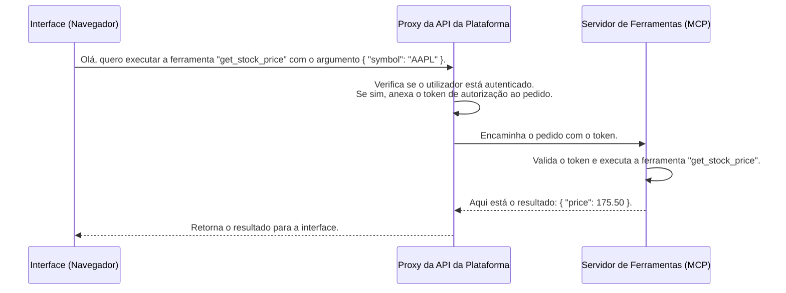

# Chapter 4: Integração com Ferramentas (MCP)


Nos capítulos anteriores, aprendemos como [criar e configurar os nossos agentes](02_gerenciamento_de_agentes_e_configuração_.md) e como lhes dar conhecimento específico através do [RAG e Gerenciamento de Documentos](03_rag_e_gerenciamento_de_documentos_.md). Os nossos agentes agora têm "cérebro" e uma "biblioteca". Mas e se precisarmos que eles façam algo, em vez de apenas saberem algo? E se precisarmos que eles ajam no mundo real?

Imagine que você pergunta ao seu agente: "Qual é a previsão do tempo para Lisboa hoje?". O conhecimento interno dele ou os documentos que você forneceu provavelmente não contêm essa informação, pois ela muda a todo momento. O agente precisa de uma forma de consultar um serviço de meteorologia externo.

É aqui que entram as **Ferramentas**. Esta funcionalidade dá aos seus agentes "mãos e sentidos" para interagir com o mundo exterior. Usando um padrão chamado **MCP (Model Context Protocol)**, os agentes podem descobrir e utilizar equipamentos especializados (ferramentas) para realizar tarefas que vão muito além da simples geração de texto.

## Os Seus Agentes, Agora com uma Caixa de Ferramentas

Pense no seu agente como um trabalhador inteligente. O RAG deu-lhe os manuais e livros de referência. As ferramentas são o seu equipamento de trabalho:

*   Uma **calculadora** para fazer contas complexas.
*   Um **buscador da web** para encontrar informações atuais.
*   Um **sistema de reservas** para agendar um voo.
*   Uma **API de consulta de ações** para verificar o preço de um ativo.

O **MCP (Model Context Protocol)** é a linguagem universal que permite que o agente entenda quais ferramentas estão disponíveis e como usá-las corretamente. É como se cada ferramenta viesse com um manual de instruções padronizado que o agente consegue ler.

A nossa plataforma oferece uma interface para você ver todas as ferramentas disponíveis e até mesmo um "playground" para testá-las antes de deixar o seu agente usá-las.

## Explorando as Ferramentas Disponíveis

O primeiro passo é saber quais ferramentas temos na nossa caixa. A plataforma oferece uma página dedicada para isso.

A interface principal, definida em `src/features/tools/index.tsx`, apresenta um catálogo de todas as ferramentas que os seus agentes podem usar. Cada ferramenta é exibida num "cartão" que mostra o seu nome e uma breve descrição do que ela faz.

```tsx
// Ficheiro: src/features/tools/index.tsx (simplificado)

export default function ToolsInterface(): React.ReactNode {
  // Hook que busca as ferramentas disponíveis na plataforma
  const { tools, loading, cursor } = useMCPContext();
  // Hook para permitir a busca por nome
  const { toolSearchTerm, filteredTools } = useSearchTools(tools);

  return (
    <div className="flex w-full flex-col gap-4 p-6">
      <div className="flex w-full items-center justify-start gap-6">
        <Wrench className="size-6" />
        <p className="text-lg font-semibold">Ferramentas</p>
        {/* Componente para buscar ferramentas */}
        <Search
          onSearchChange={debouncedSetSearchTerm}
          placeholder="Buscar ferramentas..."
        />
      </div>

      <Separator />

      {/* Grelha que exibe os cartões das ferramentas */}
      <div className="grid grid-cols-1 gap-4 md:grid-cols-2 lg:grid-cols-3">
        {loading && <ToolCardLoading />} {/* Mostra um esqueleto de carregamento */}
        {filteredTools.map((tool) => (
          <ToolCard
            key={tool.name}
            tool={tool} // O cartão da ferramenta
          />
        ))}
      </div>
      {/* ... (lógica para "Carregar Mais") ... */}
    </div>
  );
}
```

Este código é bastante direto:
1.  **`useMCPContext()`**: Este hook, que vem do nosso `MCPProvider`, é a fonte de dados. Ele é responsável por comunicar com o backend e obter a lista de todas as ferramentas.
2.  **`useSearchTools()`**: Um pequeno hook auxiliar que simplesmente filtra a lista de ferramentas com base no que o utilizador digita na barra de busca.
3.  **`ToolCard`**: Um componente React que recebe os dados de uma única ferramenta (nome, descrição) e os exibe de forma organizada e visualmente agradável.

Ao visitar esta página, você pode rapidamente ter uma ideia das capacidades que pode dar aos seus agentes.

## Testando Ferramentas no Playground

Ver uma ferramenta é uma coisa, mas como saber se ela funciona como esperado? Para isso, temos o **Playground de Ferramentas**. É um ambiente seguro onde você pode "brincar" com uma ferramenta, executando-a manualmente com diferentes entradas para ver o que ela retorna.

Imagine que temos uma ferramenta chamada `get_stock_price` que busca o preço de uma ação. No playground, você poderia:
1.  Selecionar a ferramenta `get_stock_price` da lista.
2.  Ver um formulário que pede o "Símbolo da Ação" (ex: `AAPL` para a Apple).
3.  Digitar `AAPL` no campo e clicar em "Executar Ferramenta".
4.  Ver a resposta, como `{"price": 175.50, "currency": "USD"}`.

Esta interface é controlada pelo componente `ToolsPlaygroundInterface` em `src/features/tools/playground/index.tsx`.

```tsx
// Ficheiro: src/features/tools/playground/index.tsx (simplificado)

export default function ToolsPlaygroundInterface() {
  const { callTool } = useMCPContext(); // Hook para chamar a ferramenta
  const [selectedTool, setSelectedTool] = useState<Tool>();
  const [inputValues, setInputValues] = useState({}); // Guarda o que o utilizador digita
  const [response, setResponse] = useState<any>(null); // Guarda a resposta da ferramenta
  const [isLoading, setIsLoading] = useState(false);

  // Função chamada quando o utilizador clica em "Executar"
  const handleSubmit = async () => {
    if (!selectedTool) return;
    setIsLoading(true);

    try {
      // Chama a função do hook para executar a ferramenta com os inputs fornecidos
      const toolRes = await callTool({
        name: selectedTool.name,
        args: inputValues,
      });
      setResponse(toolRes); // Atualiza o estado com a resposta
    } catch (e: any) {
      // ... (tratamento de erros)
    } finally {
      setIsLoading(false);
    }
  };

  // ... (JSX para renderizar a interface dividida em duas)

  // Painel de Input (Esquerda)
  <ResizablePanel>
    <h3 className="text-md font-medium">Input</h3>
    {/* Formulário gerado dinamicamente com base no esquema da ferramenta */}
    <SchemaForm
      schema={selectedTool.inputSchema}
      onChange={setInputValues}
    />
  </ResizablePanel>

  // Painel de Resposta (Direita)
  <ResizablePanel>
    <h3 className="text-md font-medium">Response</h3>
    {/* Visualizador que exibe a resposta ou um erro */}
    <ResponseViewer response={response} isLoading={isLoading} />
  </ResizablePanel>
}
```
A parte mais interessante aqui é o componente `<SchemaForm>`. Ele não tem campos fixos. Em vez disso, ele lê a propriedade `inputSchema` da ferramenta selecionada e gera o formulário de entrada dinamicamente. Isso torna o playground universal para qualquer ferramenta, não importa quais parâmetros ela exija.

## Por Trás das Cortinas: Como a Comunicação Acontece

Quando você clica em "Executar Ferramenta" no playground ou quando um agente decide usar uma ferramenta durante uma conversa, um fluxo de comunicação seguro e bem definido é iniciado. A nossa interface (frontend) não fala diretamente com o servidor que hospeda as ferramentas. Em vez disso, ela fala com um **proxy** na nossa própria API.

Este proxy atua como um intermediário de segurança. Ele garante que apenas pedidos autenticados possam chegar ao servidor de ferramentas.

Vamos visualizar o fluxo:



Este design de proxy é uma prática de segurança crucial, pois protege o servidor de ferramentas de acesso direto e não autorizado e centraliza toda a lógica de autenticação.

### O Guarda de Fronteira: `proxy-request.ts`

O código que implementa este intermediário seguro está em `src/app/api/oap_mcp/proxy-request.ts`. Esta é uma rota de API do Next.js que captura todos os pedidos que começam com `/api/oap_mcp` e os reencaminha para o servidor MCP real.

```typescript
// Ficheiro: src/app/api/oap_mcp/proxy-request.ts (lógica principal)

// URL do servidor MCP, lida de uma variável de ambiente
const MCP_SERVER_URL = process.env.MCP_SERVER_URL || "http://localhost:2906";

export async function proxyRequest(req: NextRequest): Promise<Response> {
  // 1. Extrai o caminho do pedido original (ex: /list_tools)
  const url = new URL(req.url);
  const path = url.pathname.replace(/^\/api\/oap_mcp/, "");

  // 2. Constrói a URL completa para o servidor de ferramentas real
  const targetUrl = new URL(`${MCP_SERVER_URL}/mcp${path}`);

  // 3. Prepara os cabeçalhos
  const headers = new Headers();
  // ... (cópia de cabeçalhos relevantes)

  // 4. Obtém e anexa o token de autenticação
  //    (Lógica para obter o token do Supabase, etc.)
  const accessToken = await getMcpAccessToken(/* ... */);
  if (accessToken) {
    headers.set("Authorization", `Bearer ${accessToken}`);
  }

  // 5. Encaminha o pedido para o servidor de ferramentas e retorna a resposta
  const response = await fetch(targetUrl, {
    method: req.method,
    headers,
    body: req.body,
  });

  return new NextResponse(response.body, { /* ... */ });
}
```
Este ficheiro é o pilar da nossa integração. Ele abstrai toda a complexidade e segurança da comunicação, permitindo que o resto da nossa aplicação (como os nossos hooks e componentes) simplesmente faça pedidos para um endpoint local (`/api/oap_mcp/...`) como se fosse magia.

### O Kit de Ferramentas do Cliente: `use-mcp.tsx`

Do lado do cliente (no navegador), usamos o hook `useMCP` (`src/hooks/use-mcp.tsx`) para facilitar a comunicação com o nosso proxy. Este hook encapsula a lógica de `fetch` para listar e chamar ferramentas.

```typescript
// Ficheiro: src/hooks/use-mcp.tsx (simplificado)

// Retorna a URL do nosso proxy
function getMCPUrlOrThrow() {
  // ... retorna algo como "http://localhost:3000/api/oap_mcp"
}

export default function useMCP() {
  // ... (estado para guardar as ferramentas)

  const createAndConnectMCPClient = async () => {
    // Usa o SDK do MCP para criar um cliente que sabe falar com o nosso proxy
    const url = getMCPUrlOrThrow();
    const connectionClient = new StreamableHTTPClientTransport(new URL(url));
    const mcp = new Client({ name: "Tools Interface", version: "1.0.0" });
    await mcp.connect(connectionClient);
    return mcp;
  };

  const getTools = async (): Promise<Tool[]> => {
    const mcp = await createAndConnectMCPClient();
    // Usa o cliente para pedir a lista de ferramentas
    const toolsResponse = await mcp.listTools();
    return toolsResponse.tools;
  };

  const callTool = async (/* ... */) => {
    const mcp = await createAndConnectMCPClient();
    // Usa o cliente para chamar uma ferramenta específica
    const response = await mcp.callTool({ /* ... */ });
    return response;
  };

  return { getTools, callTool, /* ... */ };
}
```
Quando o nosso componente `ToolsPlaygroundInterface` chama `callTool`, ele está, na verdade, a usar esta função do hook `useMCP`. O hook, por sua vez, envia o pedido para o nosso proxy (`/api/oap_mcp`), que finalmente o encaminha de forma segura para o servidor de ferramentas real.

## Conclusão

Neste capítulo, demos aos nossos agentes superpoderes. Vimos que as **Ferramentas** lhes permitem executar ações e obter informações do mundo exterior, transformando-os de meros "sabichões" em "fazedores" eficazes.

Aprendemos que o **MCP (Model Context Protocol)** é o padrão que garante que agentes e ferramentas falem a mesma língua. Explorámos a interface da plataforma, que nos permite navegar por um catálogo de ferramentas e testá-las no **Playground**. Mais importante, desvendámos a arquitetura segura por trás de tudo, onde um **proxy de API** atua como um intermediário, gerindo a autenticação e protegendo os nossos serviços.

Agora os nossos agentes têm configuração, conhecimento (RAG) e habilidades (Ferramentas). O cenário está montado. No próximo capítulo, vamos juntar tudo e ver como interagimos com estes agentes superdotados através da interface de chat da plataforma.

A seguir: [Capítulo 5: Interface de Chat e Streaming de Mensagens](05_interface_de_chat_e_streaming_de_mensagens_.md)

---

Generated by [AI Codebase Knowledge Builder](https://github.com/The-Pocket/Tutorial-Codebase-Knowledge)