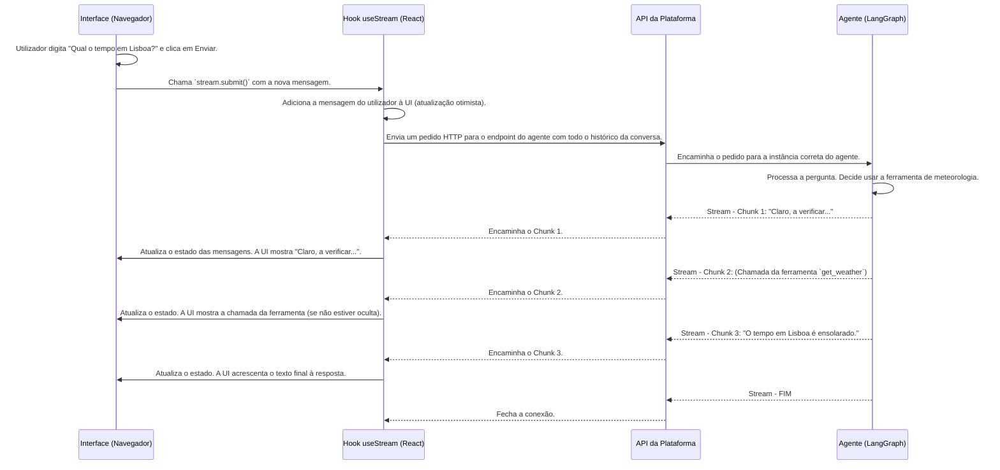

# Chapter 5: Interface de Chat e Streaming de Mensagens


Nos capítulos anteriores, transformámos os nossos agentes em especialistas. Demos-lhes configuração, conhecimento através do [RAG e Gerenciamento de Documentos](03_rag_e_gerenciamento_de_documentos_.md) e habilidades práticas com a [Integração com Ferramentas (MCP)](04_integração_com_ferramentas__mcp__.md). Os nossos agentes estão prontos, equipados e à espera. Agora, está na hora de fazer a coisa mais importante: conversar com eles.

Este capítulo é sobre o coração da interação do utilizador: a **interface de chat**. Pense nela como a sua aplicação de mensagens favorita, como o WhatsApp ou o Messenger, mas em vez de falar com amigos, você está a conversar com os seus assistentes de IA superpoderosos.

Vamos descobrir como a plataforma cria uma experiência de conversação fluida e em tempo real. A chave aqui é uma técnica chamada **streaming**, que faz com que as respostas do agente apareçam pedaço por pedaço, como se ele estivesse a "digitar" em tempo real, em vez de nos fazer esperar por uma resposta completa e demorada.

## Como Funciona uma Conversa com um Agente?

Quando você envia uma mensagem para um agente, um processo dinâmico começa. Não é um simples pedido e resposta; é uma conexão contínua. Vamos quebrar os componentes que tornam isso possível.

1.  **A Interface de Chat (`ChatInterface`):** Este é o ecrã principal que você vê. É o contentor que organiza tudo: a área de conversa, os botões das barras laterais de histórico e configuração, etc.

2.  **O Fio da Conversa (`Thread`):** Esta é a lista de mensagens que você vê, o histórico da sua conversa com o agente. Ela contém as suas mensagens (humanas) e as respostas do agente (IA).

3.  **O Provedor de Streaming (`StreamProvider`):** Este é o motor por trás de tudo. É um componente invisível que gere a conexão de comunicação ao vivo entre o seu navegador e o agente. Quando você envia uma mensagem, o `StreamProvider` entrega-a ao agente e depois "ouve" atentamente a resposta, atualizando a interface à medida que os pedaços de dados chegam.

4.  **As "Bolhas" de Mensagem (`HumanMessage` e `AssistantMessage`):** Cada mensagem individual na conversa é um destes componentes. `HumanMessage` mostra o que você escreveu, e `AssistantMessage` mostra o que o agente respondeu. A mensagem do assistente é especial, pois pode exibir não apenas texto, mas também informações sobre as ferramentas que está a usar.

## Conversando com o seu Primeiro Agente

Vamos seguir a jornada de uma única mensagem, desde o momento em que você a digita até receber a resposta.

### Passo 1: Selecionar um Agente

A primeira coisa que a plataforma precisa de saber é: com quem você quer falar? Se nenhum agente estiver selecionado, a interface de chat irá apresentar-lhe uma lista de todos os seus agentes disponíveis.

```tsx
// Ficheiro: src/features/chat/providers/Stream.tsx (lógica de seleção)

// Se nenhum agente (agentId) ou ambiente (deploymentId) estiver selecionado...
if (!agentId || !deploymentId) {
  return (
    // ...mostra uma interface para escolher um agente.
    <div className="flex w-full items-center justify-center p-4">
      <div className="flex flex-col ...">
        {/* ... (Mensagem de boas-vindas) ... */}
        <AgentsCombobox
          agents={agents}
          value={value}
          setValue={(v) => handleValueChange(v)}
          // ...
        />
        <Button onClick={handleStartChat}>Iniciar Chat</Button>
      </div>
    </div>
  );
}

// Se um agente for selecionado, envolve o resto da aplicação com o StreamSession
return (
  <StreamSession agentId={agentId} deploymentId={deploymentId} ...>
    {children}
  </StreamSession>
);
```
Este código, dentro do `StreamProvider`, age como um porteiro. Ele verifica se um agente foi escolhido. Se não, ele mostra o componente `AgentsCombobox` para que você possa escolher um. Assim que você seleciona um agente e clica em "Iniciar Chat", o `StreamProvider` guarda a sua escolha e carrega a interface de chat principal.

### Passo 2: Enviar uma Mensagem

Agora que estamos no chat, vemos uma caixa de texto na parte inferior, à espera da nossa mensagem. Esta parte da interface é gerida pelo componente `Thread`.

```tsx
// Ficheiro: src/features/chat/components/thread/index.tsx (simplificado)

export function Thread() {
  const stream = useStreamContext(); // Obtém o nosso gestor de stream
  // ... (outros estados)

  const handleSubmit = (e: FormEvent) => {
    e.preventDefault();
    const formData = new FormData(e.currentTarget as HTMLFormElement);
    const content = (formData.get("input") as string | undefined)?.trim() ?? "";

    if (content.length === 0) return; // Não envia mensagens vazias

    // Cria um objeto de mensagem humana
    const newHumanMessage: Message = {
      id: uuidv4(),
      type: "human",
      content: content,
    };

    // Envia a mensagem para o agente através do stream
    stream.submit({ messages: [...stream.messages, newHumanMessage] });
    
    // Limpa a caixa de texto
    (e.currentTarget as HTMLFormElement).reset();
  };

  return (
    // ... (renderização das mensagens)
    <form onSubmit={handleSubmit}>
      <textarea
        name="input"
        placeholder="Digite sua mensagem..."
        // ...
      />
      <Button type="submit">Enviar</Button>
    </form>
  );
}
```
Quando você digita "Olá, mundo!" e clica em "Enviar", a função `handleSubmit` faz duas coisas importantes:
1.  Cria um objeto de mensagem que representa a sua entrada.
2.  Chama `stream.submit()`, entregando a nova mensagem ao nosso `StreamProvider` para que ele a envie ao agente.

### Passo 3: Receber a Resposta em Tempo Real

Assim que o `StreamProvider` envia a sua mensagem, ele começa a receber a resposta do agente. A resposta não chega toda de uma vez. Ela vem em pedaços (chunks). O `StreamProvider` atualiza o estado das mensagens a cada novo pedaço recebido.

O componente `AssistantMessage` é o responsável por mostrar esta resposta em construção.

```tsx
// Ficheiro: src/features/chat/components/thread/messages/ai.tsx (simplificado)

export function AssistantMessage({ message }: { message: Message }) {
  // `message.content` é atualizado pelo stream à medida que os dados chegam
  const contentString = getContentString(message.content);

  // Verifica se o agente está a usar ferramentas
  const hasToolCalls = "tool_calls" in message && message.tool_calls?.length > 0;

  return (
    <div className="flex flex-col gap-2">
      {/* Renderiza o texto da mensagem, que cresce em tempo real */}
      {contentString.length > 0 && <MarkdownText>{contentString}</MarkdownText>}

      {/* Se houver chamadas de ferramentas, renderiza um componente para elas */}
      {hasToolCalls && <ToolCalls toolCalls={message.tool_calls} />}
    </div>
  );
}
```
Este componente é reativo. À medida que o `StreamProvider` atualiza o objeto `message` com mais texto, o React automaticamente re-renderiza o `AssistantMessage`, e você vê o texto a aparecer na tela, palavra por palavra. Se o agente decidir usar uma ferramenta, essa informação também aparecerá aqui, renderizada pelo componente `ToolCalls`. É esta reatividade que cria a experiência de streaming fluida.

## Por Trás das Cortinas: O Fluxo de uma Mensagem

Como é que a mensagem viaja da sua caixa de texto para o agente e volta como uma resposta em streaming? O processo envolve o nosso frontend (React), a nossa API de plataforma e o motor do agente (LangGraph).



Este diagrama mostra o fluxo contínuo de dados. A chave é que o agente não espera para ter a resposta completa. Ele envia atualizações assim que tem algo novo para partilhar, seja texto parcial ou uma decisão de usar uma ferramenta.

## O Código que Potencia o Chat

Vamos aprofundar um pouco mais nos ficheiros que orquestram esta dança.

### O Coração do Streaming: `StreamProvider.tsx`

Este provedor utiliza o hook `useStream` da biblioteca `@langchain/langgraph-sdk/react`, que faz todo o trabalho pesado de gerir a comunicação em tempo real.

```tsx
// Ficheiro: src/features/chat/providers/Stream.tsx (configuração do stream)

const StreamSession = ({ agentId, deploymentId, children }) => {
  const [threadId, setThreadId] = useQueryState("threadId");

  // O hook `useStream` da biblioteca LangGraph
  const streamValue = useTypedStream({
    // URL da API para onde enviar as mensagens
    apiUrl: deploymentUrl, 
    // ID do assistente com quem estamos a falar
    assistantId: agentId,
    // ID da conversa atual, para manter o histórico
    threadId: threadId ?? null,
    // Função para atualizar o ID da conversa na URL quando um novo chat começa
    onThreadId: (id) => {
      setThreadId(id);
    },
    // ... (outras configurações como cabeçalhos de autenticação)
  });

  // Disponibiliza o `streamValue` (com `submit`, `messages`, `isLoading`, etc.)
  // para todos os componentes filhos
  return (
    <StreamContext.Provider value={streamValue}>
      {children}
    </StreamContext.Provider>
  );
};
```
O `useStream` é configurado com as informações essenciais: para onde enviar a mensagem (`apiUrl`), para quem (`assistantId`), e em qual conversa (`threadId`). Ele devolve um objeto `streamValue` que contém tudo o que precisamos: o estado atual das mensagens (`messages`), o estado de carregamento (`isLoading`), e a função para enviar uma nova mensagem (`submit`).

### Enviando o Pacote Completo: `thread/index.tsx`

Quando chamamos `stream.submit()`, não enviamos apenas a nova mensagem. Enviamos também a configuração atual do agente, que pode ter sido alterada na [barra lateral de configuração](02_gerenciamento_de_agentes_e_configuração_.md).

```tsx
// Ficheiro: src/features/chat/components/thread/index.tsx (handleSubmit detalhado)

const handleSubmit = (e: FormEvent) => {
  // ... (código para obter o conteúdo da mensagem)
  if (!agentId) return;

  const newHumanMessage: Message = { /* ... */ };

  // Obtém a configuração atual do agente (ex: temperatura, modelo) do nosso armazém Zustand
  const { getAgentConfig } = useConfigStore.getState();

  stream.submit(
    { messages: [...toolMessages, newHumanMessage] },
    {
      // A configuração do agente é enviada a cada chamada
      config: {
        configurable: getAgentConfig(agentId), 
      },
      // ... (outras opções)
    },
  );
  // ...
};
```
Isto é extremamente poderoso. Significa que, se você ajustar a "criatividade" (temperatura) do agente na barra lateral, a próxima mensagem que você enviar já usará essa nova configuração, permitindo ajustes em tempo real no comportamento do agente.

### Tratando Diferentes Tipos de Conteúdo: `thread/messages/human.tsx` e `ai.tsx`

As mensagens não são apenas texto. Elas podem conter imagens, ficheiros e, no caso das respostas da IA, chamadas de ferramentas. Os nossos componentes de mensagem são construídos para lidar com essa complexidade.

```tsx
// Ficheiro: src/features/chat/components/thread/messages/human.tsx (renderização multimodal)

export function HumanMessage({ message }: { message: Message }) {
  // ...
  return (
    // ...
    // Se a mensagem contiver blocos de imagem/ficheiro...
    {Array.isArray(message.content) && (
      <div className="flex flex-wrap gap-2">
        {message.content.map((block) =>
          // ...renderiza uma pré-visualização para cada bloco.
          isBase64ContentBlock(block) ? <MultimodalPreview block={block} /> : null
        )}
      </div>
    )}
    {/* Se houver texto, renderiza-o também */}
    {contentString && <p>{contentString}</p>}
    // ...
  );
}
```
A `HumanMessage` verifica o conteúdo e, se encontrar algo que não seja texto (como uma imagem que você enviou), renderiza uma pré-visualização. Da mesma forma, a `AssistantMessage` verifica se há `tool_calls` e as renderiza usando um componente especializado, dando-lhe uma visão clara das ações do agente.

## Conclusão

Neste capítulo, mergulhámos na experiência central do utilizador da Plataforma VIA: a **interface de chat**. Vimos como ela vai além de um simples formulário de envio, criando uma conversa interativa e em tempo real.

Aprendemos que a magia do **streaming** permite que as respostas dos agentes apareçam de forma fluida e natural. Desvendámos a arquitetura por trás disto, onde o `StreamProvider` gere a conexão ao vivo, o `Thread` orquestra a interface da conversa, e os componentes `HumanMessage` e `AssistantMessage` renderizam o conteúdo dinâmico, incluindo texto, ferramentas e ficheiros.

Agora que dominamos a arte de conversar com os nossos agentes, surge uma questão interessante: o que acontece quando um agente precisa de parar a meio de uma tarefa e pedir a nossa ajuda ou aprovação? Como gerimos essas pausas e retomadas na conversa? É isso que vamos explorar no próximo capítulo, ao apresentarmos a Caixa de Entrada.

A seguir: [Capítulo 6: Caixa de Entrada e Interrupções de Agente](06_caixa_de_entrada_e_interrupções_de_agente_.md)

---

Generated by [AI Codebase Knowledge Builder](https://github.com/The-Pocket/Tutorial-Codebase-Knowledge)