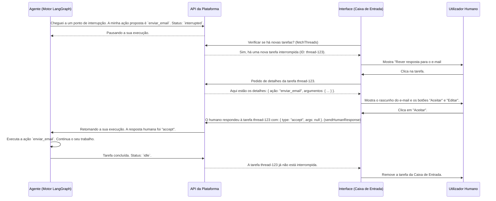

# Chapter 6: Caixa de Entrada e Interrupções de Agente


No capítulo anterior, sobre a [Interface de Chat e Streaming de Mensagens](05_interface_de_chat_e_streaming_de_mensagens_.md), aprendemos a conversar com os nossos agentes de IA. Vimos como as mensagens fluem em tempo real, criando uma experiência interativa. Mas, e se a automação total não for sempre desejável? E se um agente precisar de um "sim" de um humano antes de tomar uma decisão crítica?

É aqui que entra a **Caixa de Entrada e as Interrupções de Agente**. Pense nisto como uma rede de segurança. É uma funcionalidade crucial que permite que os agentes pausem o seu trabalho e peçam a sua aprovação ou orientação antes de prosseguirem. Imagine um agente que redige um e-mail para um cliente importante. Em vez de o enviar imediatamente, ele pode parar e dizer: "Revê este rascunho, por favor". Esta pausa é uma **interrupção**, e o pedido aparece na sua **Caixa de Entrada**.

Este mecanismo é a chave para construir sistemas de IA confiáveis e seguros, onde a velocidade da automação é equilibrada com a supervisão e o julgamento humano. Vamos aprender a gerir estas pausas e a colaborar com os nossos agentes.

## O Que é uma Interrupção?

Uma **interrupção** é um momento em que um agente para deliberadamente o que está a fazer e espera por uma instrução de um humano. É como um funcionário júnior que, em vez de tomar uma decisão arriscada sozinho, vai ter com o seu gestor para pedir uma segunda opinião.

Na nossa plataforma, uma interrupção acontece quando o fluxo de trabalho de um agente chega a um ponto específico que exige intervenção humana. Isto pode ser para:
*   **Aprovar uma Ação**: Como "enviar este e-mail" ou "processar este reembolso".
*   **Editar Informação**: Como "corrigir os detalhes neste rascunho".
*   **Fornecer Informação**: Como "qual é o desconto a aplicar a este cliente?".

Quando uma interrupção ocorre, a tarefa do agente (chamada de `thread` ou fio de execução) é marcada como `interrupted` (interrompida) e aparece na sua Caixa de Entrada.

## A Caixa de Entrada: O seu Centro de Controlo

A Caixa de Entrada é a interface onde todas as tarefas interrompidas são listadas. É o seu centro de comando para supervisionar o trabalho dos seus agentes.

A interface da Caixa de Entrada (`AgentInbox`) é dividida em duas visualizações principais:
1.  **Visualização de Lista (`AgentInboxView`):** Mostra todas as tarefas que estão à sua espera. Cada item na lista representa um agente que está em pausa.
2.  **Visualização de Detalhe (`ThreadView`):** Quando você clica numa tarefa, esta visualização é aberta, mostrando todos os detalhes da interrupção: o que o agente estava a fazer, qual a ação que propõe e quais as opções que você tem.

Vamos ver a estrutura principal do componente `AgentInbox`.

```tsx
// Ficheiro: src/components/agent-inbox/index.tsx (simplificado)

export function AgentInbox<
  ThreadValues extends Record<string, any> = Record<string, any>,
>() {
  // Obtém o ID da tarefa/thread selecionada a partir da URL
  const [selectedThreadIdParam] = useQueryState(VIEW_STATE_THREAD_QUERY_PARAM);

  const isStateViewOpen = !!selectedThreadIdParam;

  // ... (lógica para gerir o estado de scroll e seleção do agente)

  // Se uma tarefa estiver selecionada, mostra a vista de detalhe
  if (isStateViewOpen) {
    return <ThreadView threadId={selectedThreadIdParam} />;
  }

  // Caso contrário, mostra a lista de tarefas pendentes
  return <AgentInboxView /* ... */ />;
}
```

Este código age como um "roteador". Ele verifica a URL da página. Se a URL contiver um `threadId`, significa que queremos ver os detalhes de uma tarefa específica e ele renderiza o `ThreadView`. Caso contrário, mostra a `AgentInboxView` com a lista de todas as tarefas.

## Gerindo uma Tarefa Interrompida

Vamos imaginar um cenário: o seu agente de e-mail processou uma mensagem de um cliente e preparou uma resposta. Em vez de enviar, ele cria uma interrupção.

1.  **Ver a Tarefa na Caixa de Entrada**: Você navega até à Caixa de Entrada e vê uma nova tarefa: "Rever resposta para o e-mail #123".
2.  **Abrir os Detalhes**: Você clica na tarefa. A `ThreadView` é aberta.
3.  **Analisar e Agir**: No centro do ecrã, você vê a ação proposta pelo agente (por exemplo, o rascunho do e-mail). No topo, encontra um painel de ações (`ThreadActionsView`) com botões como "Aceitar", "Editar" ou "Ignorar".

É aqui que você toma a sua decisão.

```tsx
// Ficheiro: src/components/agent-inbox/components/thread-actions-view.tsx (simplificado)

export function ThreadActionsView<ThreadValues extends Record<string, any>>({
  threadData,
  /* ... */
}: ThreadActionsViewProps<ThreadValues>) {
  // Um hook que nos dá todas as ações possíveis para uma interrupção
  const actions = useInterruptedActions<ThreadValues>({
    threadData: isInterrupted ? threadData : null,
    // ...
  });

  // Aceder às permissões da interrupção
  const acceptAllowed = threadData.interrupts?.[0]?.config?.allow_accept ?? false;

  // ... (JSX para o cabeçalho e outras informações)

  return (
    <div className="flex w-full flex-col gap-9 p-12">
      {/* ... Cabeçalho com título, etc. ... */}

      {/* Ações para a interrupção */}
      <InboxItemInput
        acceptAllowed={acceptAllowed}
        // ... (outras propriedades para configurar o formulário de resposta)
        handleSubmit={actions?.handleSubmit} // Função chamada ao clicar em "Aceitar" ou "Submeter"
      />

      {/* Outras ações, como ignorar */}
      <Button
        variant="outline"
        onClick={actions?.handleIgnore}
        disabled={actions?.loading}
      >
        Ignorar Thread
      </Button>
    </div>
  );
}
```

O componente `ThreadActionsView` usa o *hook* `useInterruptedActions` para obter toda a lógica necessária. Ele verifica que ações são permitidas (`allow_accept`, `allow_edit`, etc.) e mostra os botões correspondentes. Quando você clica num botão, a função correspondente do *hook* (ex: `handleSubmit` ou `handleIgnore`) é chamada.

## Por Trás das Cortinas: O Ciclo de Vida de uma Interrupção

O que acontece exatamente quando um agente é interrompido e você responde? Este fluxo de comunicação é orquestrado entre a interface, a nossa API e o motor do agente.


Este ciclo garante que o agente só prossiga após receber uma orientação explícita do utilizador, criando um fluxo de trabalho colaborativo.

## O Código que Potencia a Caixa de Entrada

A magia da Caixa de Entrada é gerida por um conjunto de tipos de dados, contextos e *hooks* que trabalham em conjunto.

### A Linguagem Comum: `types.ts`

Para que o agente e a interface se entendam, eles precisam de uma linguagem comum. Esta linguagem é definida em `src/components/agent-inbox/types.ts`.

```typescript
// Ficheiro: src/components/agent-inbox/types.ts (simplificado)

/**
 * Representa um pedido de ação do agente para o humano.
 */
export interface ActionRequest {
  action: string;
  args: Record<string, any>;
}

/**
 * A estrutura de uma interrupção. Contém o pedido e as ações permitidas.
 */
export interface HumanInterrupt {
  action_request: ActionRequest;
  config: {
    allow_ignore: boolean;
    allow_respond: boolean;
    allow_edit: boolean;
    allow_accept: boolean;
  };
}

/**
 * A resposta do humano para o agente.
 */
export type HumanResponse = {
  type: "accept" | "ignore" | "response" | "edit";
  args: null | string | ActionRequest;
};
```
Estes tipos de dados garantem que, quando um agente diz "Estou interrompido", a interface sabe exatamente o que o agente quer e o que o utilizador pode fazer em resposta.

### O Gestor de Tarefas: `ThreadContext.tsx`

O `ThreadsContext` (`src/components/agent-inbox/contexts/ThreadContext.tsx`) é o cérebro que gere os dados da Caixa de Entrada. É um Provedor de Contexto do React que encapsula a lógica para:
*   **`fetchThreads`**: Buscar a lista de tarefas da API para popular a Caixa de Entrada.
*   **`sendHumanResponse`**: Enviar a decisão do utilizador (Aceitar, Editar, etc.) de volta para a API para que o agente possa continuar.

```tsx
// Ficheiro: src/components/agent-inbox/contexts/ThreadContext.tsx (simplificado)

function ThreadsProviderInternal({ children }) {
  const { session } = useAuthContext();
  const [agentInboxId] = useQueryState("agentInbox");

  const fetchThreads = React.useCallback(async (agentId, deploymentId) => {
    setLoading(true);
    const client = createClient(deploymentId, session.accessToken);
    // Busca as tarefas com base no status "interrupted"
    const threads = await client.threads.search({ status: "interrupted", /* ... */ });
    // ... processa e atualiza o estado com as tarefas
    setThreadData(processedData);
    setLoading(false);
  }, [/* ... */]);

  const sendHumanResponse = (threadId: string, response: HumanResponse[]) => {
    const client = createClient(/* ... */);
    // Envia a resposta humana para a API para retomar o agente
    return client.runs.create(threadId, assistantId, {
      command: { resume: response },
    });
  };

  // ... (disponibiliza estas funções através do contexto)
}
```

### O Cérebro das Ações: `use-interrupted-actions.tsx`

Este *hook* (`src/components/agent-inbox/hooks/use-interrupted-actions.tsx`) é a peça que liga a interface do utilizador à lógica do `ThreadsContext`. Quando a `ThreadActionsView` o chama, ele prepara tudo o que é necessário para gerir uma interrupção.

```tsx
// Ficheiro: src/components/agent-inbox/hooks/use-interrupted-actions.tsx (lógica de submissão)

export default function useInterruptedActions({ threadData, setThreadData }) {
  // Obtém a função `sendHumanResponse` do contexto
  const { sendHumanResponse, fetchThreads } = useThreadsContext();
  const [loading, setLoading] = React.useState(false);
  const [humanResponse, setHumanResponse] = React.useState<HumanResponseWithEdits[]>([]);

  // Função chamada quando o utilizador clica em "Aceitar", "Submeter", etc.
  const handleSubmit = async (e) => {
    e.preventDefault();
    setLoading(true);
    
    // Envia a resposta humana para o contexto
    await sendHumanResponse(threadData.thread.thread_id, humanResponse);

    toast("Sucesso", { description: "Resposta submetida com sucesso." });
    
    // Atualiza a lista de tarefas na Caixa de Entrada
    await fetchThreads(/* ... */);
    setLoading(false);
    
    // Volta para a visualização de lista
    await setSelectedThreadId(null);
  };
  
  return { handleSubmit, loading, humanResponse, setHumanResponse, /* ... */ };
}
```

O `handleSubmit` encapsula todo o fluxo:
1.  Impede que a página recarregue.
2.  Define o estado de carregamento para dar feedback ao utilizador.
3.  Chama `sendHumanResponse` para enviar a decisão para a API.
4.  Mostra uma notificação de sucesso.
5.  Atualiza a Caixa de Entrada, que fará com que a tarefa concluída desapareça.
6.  Redireciona o utilizador de volta para a lista de tarefas.

## Conclusão da Série

Neste capítulo, explorámos a Caixa de Entrada, um componente vital para a colaboração segura entre humanos e IA. Aprendemos como as **interrupções** permitem que os agentes pausem e peçam a nossa supervisão, e como a **Caixa de Entrada** nos dá o poder de rever, editar e aprovar as suas ações. Este ciclo de "pausar, rever, retomar" é fundamental para criar aplicações de IA que são não apenas inteligentes, mas também seguras e confiáveis.

Com isto, chegamos ao fim da nossa jornada pela Plataforma de Agentes VIA.

Começámos por garantir a segurança com a [Autenticação e Autorização](01_autenticação_e_autorização_.md). Depois, aprendemos a [criar e configurar os nossos agentes](02_gerenciamento_de_agentes_e_configuração_.md), dando-lhes personalidade. Demos-lhes conhecimento especializado através do [RAG e Gerenciamento de Documentos](03_rag_e_gerenciamento_de_documentos_.md) e habilidades práticas com a [Integração com Ferramentas (MCP)](04_integração_com_ferramentas__mcp__.md). Finalmente, vimos como [conversar com eles](05_interface_de_chat_e_streaming_de_mensagens_.md) e, agora, como supervisioná-los.

Você agora tem uma compreensão completa dos blocos de construção essenciais da nossa plataforma. Está equipado para construir os seus próprios assistentes de IA sofisticados, seguros e colaborativos.

Parabéns por concluir o tutorial! O futuro da automação assistida por humanos está nas suas mãos.

---

Generated by [AI Codebase Knowledge Builder](https://github.com/The-Pocket/Tutorial-Codebase-Knowledge)