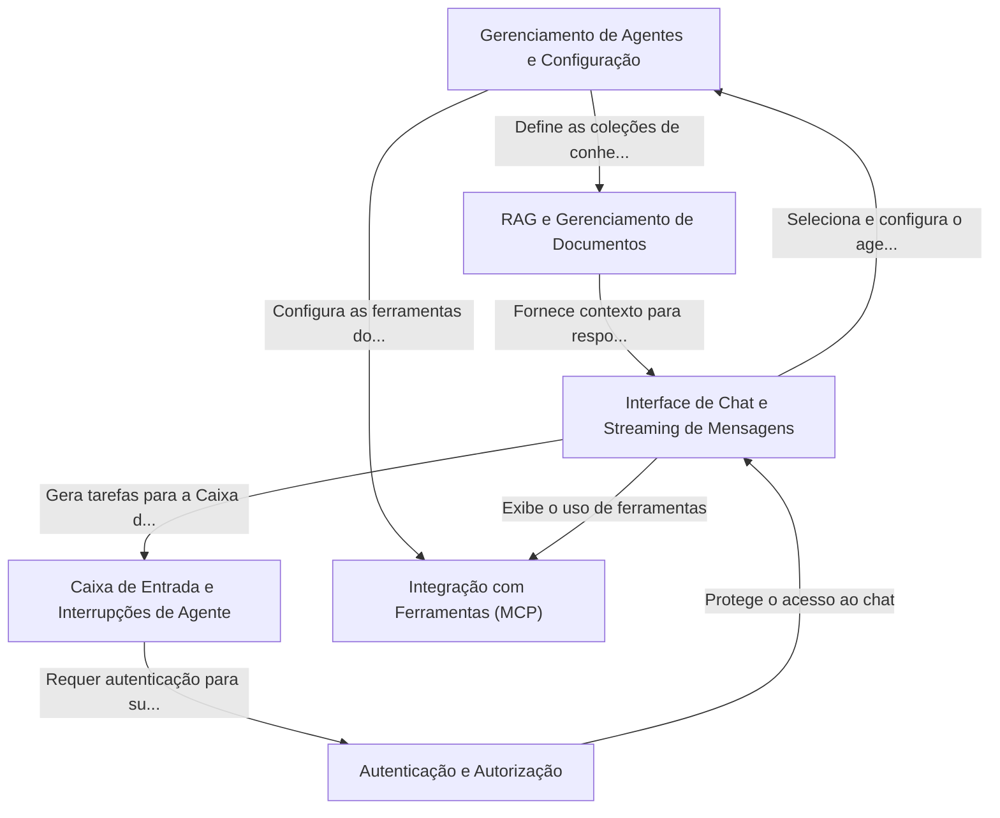

# Tutorial: Plataforma de Agentes - VIA

A **Plataforma de Agentes - VIA** é um ambiente completo para criar, gerenciar e interagir com assistentes de Inteligência Artificial. Você pode conversar com os agentes através de uma *interface de chat* intuitiva, semelhante a um aplicativo de mensagens.

Cada agente pode ser personalizado para ter conhecimentos específicos, "alimentando-o" com seus próprios documentos (usando a funcionalidade de *RAG*), e também pode ser equipado com *ferramentas* externas (como uma calculadora ou um buscador da web) para realizar tarefas mais complexas.

Além disso, a plataforma inclui uma *Caixa de Entrada* de supervisão, que garante que ações importantes dos agentes possam ser revisadas e aprovadas por um humano antes de serem executadas, criando um fluxo de trabalho seguro e confiável.

## Chapters

1. [Autenticação e Autorização
](01_autenticação_e_autorização_.md)
2. [Gerenciamento de Agentes e Configuração
](02_gerenciamento_de_agentes_e_configuração_.md)
3. [RAG e Gerenciamento de Documentos
](03_rag_e_gerenciamento_de_documentos_.md)
4. [Integração com Ferramentas (MCP)
](04_integração_com_ferramentas__mcp__.md)
5. [Interface de Chat e Streaming de Mensagens
](05_interface_de_chat_e_streaming_de_mensagens_.md)
6. [Caixa de Entrada e Interrupções de Agente
](06_caixa_de_entrada_e_interrupções_de_agente_.md)

---

Generated by [AI Codebase Knowledge Builder](https://github.com/The-Pocket/Tutorial-Codebase-Knowledge)
